# DevOps 08 CI2

## Lernjournal

### Jenkins und SonarQube: Warum gleiches Docker-Netzwerk?

Da sowohl Jenkins als auch SonarQube in separaten Docker-Containern laufen, befinden sie sich standardmässig in voneinander isolierten Netzwerken. Das bedeutet, dass ein Container (z. B. Jenkins) einen anderen (z. B. SonarQube) nicht direkt über `localhost` erreichen kann, weil sich `localhost` jeweils nur auf den eigenen Container bezieht.

Um eine direkte Kommunikation zu ermöglichen, müssen beide Container im **gleichen benutzerdefinierten Docker-Netzwerk** verbunden sein. Dadurch können sie sich gegenseitig über ihre Container-Namen (z. B. `sonarqube`) ansprechen. In den Sonar-Analyse-Befehlen muss deshalb `localhost` durch den tatsächlichen Container-Namen ersetzt werden.

### Netzwerk Erstellung 

In `cmd` ein eigenes Netzwerk mit dem Befehl `docker network create jenkins-network` erstellen.

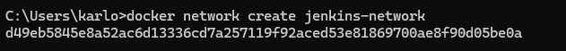

Anschliessend kann jeweils SonarQube und Jenkins mit den zwei Befehlen zum Netzwerk hinzugefügt werden:

- docker network connect jenkins-network sonarqube
- docker network connect jenkins-network jenkins

### Shell-Befehl in Jenkins als Post-Build-Aktion einfügen

In Jenkins wird unter **Konfiguration** der Bereich **Post-Build-Aktionen** geöffnet. Dort wird die Option **Build-Schritt hinzufügen** ausgewählt und anschliessend **Shell ausführen“** als Schritt gewählt. In das erscheinende Eingabefeld wird der benötigte Shell-Befehl eingegeben. Nach dem Eintragen wird die Konfiguration gespeichert, sodass der Befehl automatisch nach dem Build-Prozess ausgeführt wird. Befehl: 

`cd backend ./gradlew sonar -Dsonar.projectKey=filipkar-backend -Dsonar.projectName='filipkar backend' -Dsonar.host.url=http://sonarqube:9000 -Dsonar.token=[TOKEN]`

Der gleiche Prozess wird auch für das Frontend gemacht. Ein neuer Build-Schritt wird hinzugefügt. Nach dem Eintragen wird die Konfiguration gespeichert, sodass der Befehl automatisch nach dem Build-Prozess ausgeführt wird.

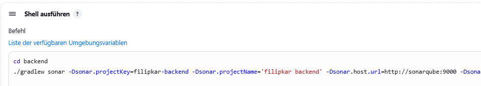

Nachdem beide Shell-Befehle für die SonarQube-Analyse erfolgreich in die Jenkins-Konfiguration integriert wurden, wird der Build gestartet. In der Build-Übersicht ist deutlich ersichtlich, dass der Build erfolgreich durchgelaufen ist und die Anbindung an SonarQube korrekt funktioniert hat.

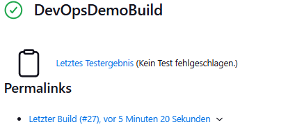

Zur Kontrolle kann auch im SonarQube nachgeschaut werden, ob die Analyse erfolgreich war.

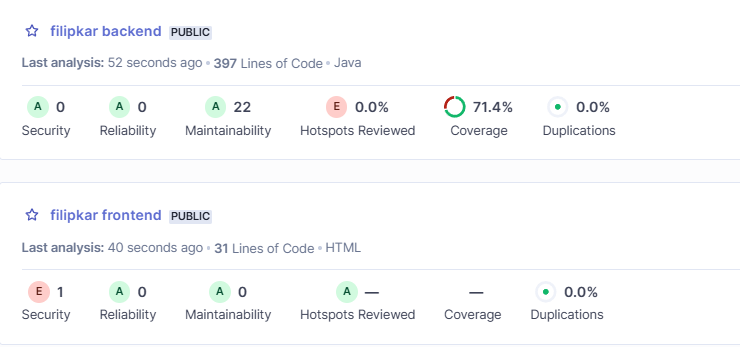

### Jenkins und Docker-Integration

Für die Docker-basierte Build-Ausführung wird in Jenkins ein neues Projekt mit dem Namen `DevOpsDemoDockerBuild` angelegt. Dabei handelt es sich um ein Freestyle-Projekt mit minimaler Grundkonfiguration. Zunächst wird das entsprechende GitHub-Repository angegeben, aus dem der Code bezogen werden soll. Da in einem früheren Schritt bereits ein gültiger Zugangstoken als Credential hinterlegt wurde, kann dieser nun direkt ausgewählt werden.

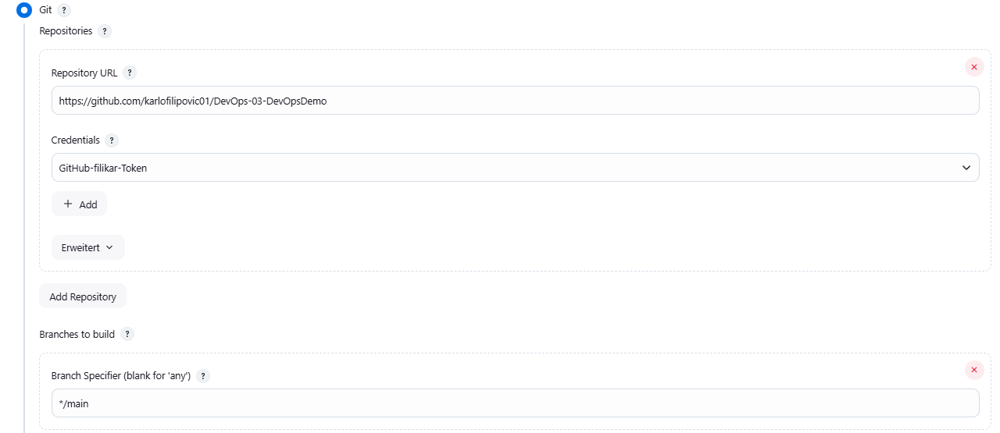

Im nächsten Schritt wird ein **Build-Schritt** hinzugefügt, der einen Docker-Befehl ausführt – beispielsweise um ein Image zu bauen. Wichtig ist hierbei, dass Docker aus Jenkins heraus angesprochen werden kann. Standardmässig ist das nicht möglich, wenn der Docker-Daemon nicht korrekt erreichbar ist.

Damit Jenkins per TCP auf den Docker-Daemon zugreifen kann, muss in **Docker Desktop** unter den Einstellungen die Option  
**Expose daemon on tcp://localhost:2375 without TLS** aktiviert werden.

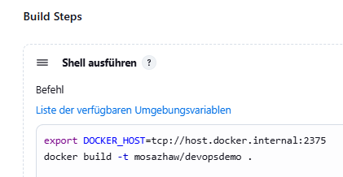

Erst nach dieser Konfiguration ist ein Zugriff über die Umgebungsvariable `DOCKER_HOST=tcp://host.docker.internal:2375` möglich. Anschliessend kann der Build über den Button **Jetzt bauen** gestartet werden. Im folgenden Schritt sollte der Build erfolgreich durchlaufen und die Docker-Aktion abgeschlossen werden.

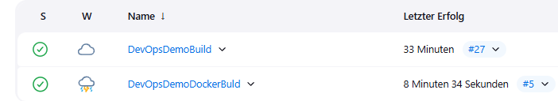

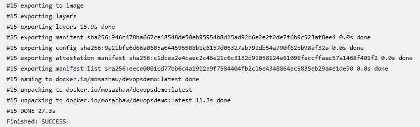

### Jenkins-Pipeline

Für den Jenkins-Pipeline-Build wird in Jenkins ein neues Projekt mit dem Namen `DevOpsDemoDockerBuild` angelegt. Dabei handelt es sich um ein **Pipeline**-Projekt mit  Grundkonfigurationen.

Unter dem Reiter **Pipeline** wird das gewünschte Skript in das Feld **Script** eingefügt.

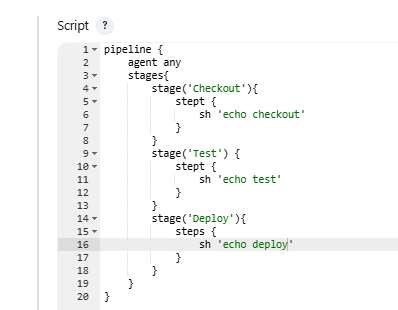

Anschliessend kann der Build-Vorgang über den Button **Jetzt bauen** gestartet werden. Nach der erfolgreichen Ausführung ist folgendes in der Konsole zu sehen:

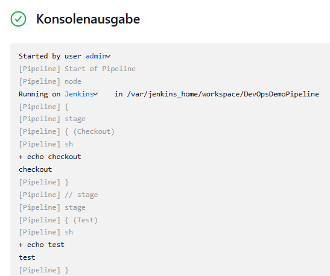

### Pipeline-Skript erweitern mit Git-Checkout

Nachdem das erste Skript erfolgreich ausgeführt wurde, kann es unter derselben Konfiguration erweitert werden. Jenkins bietet unter dem Abschnitt **Pipeline Syntax** einen sogenannten **Generator**, mit dem sich Groovy-Code für bestimmte Schritte automatisch generieren lässt.

In diesem Fall wird darüber der Code zum **Checkout des Source-Codes aus GitHub** erzeugt. Dazu wird im Dropdown-Menü **Sample Step** die Option  
`checkout: Check out from version control` ausgewählt.

Wichtig: Der **Branch Specifier** muss auf `main` geändert werden (statt dem standardmässig eingetragenen `master`), damit das Projekt aus dem richtigen Branch geladen und korrekt ausgeführt wird.

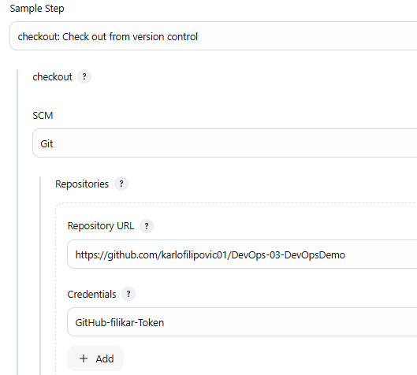

Nachdem kann auch **Generate Pipeline Script** gedrückt werden. Dabei erhalten wir ieinen Code

### Pipeline-Snippet für Git-Checkout generieren

Nachdem die gewünschten Einstellungen im **Snippet Generator** vorgenommen wurden, kann über den Button **Generate Pipeline Script** automatisch der passende Groovy-Code erzeugt werden.  In diesem Fall wird ein `checkout`-Befehl generiert, der den Quellcode aus dem GitHub-Repository auf dem Branch `main` abruft. Zusätzlich wird das hinterlegte Jenkins-Credential für den Zugriff verwendet. 

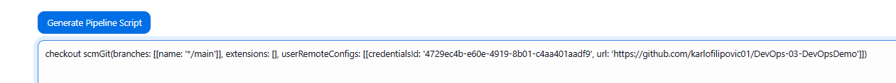

Der generierte Code kann direkt in das Pipeline-Skript eingefügt werden. Unterhalb des `sh 'echo checkout'`. 

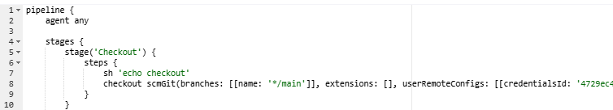

Der ganze Build kann mit dem angepasstem Skript nochmals ausgeführt werden. Dabei wird der Checkout im Build selbst unter **Workspace** ersichtlich. 

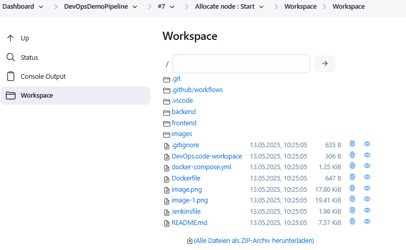

### Jenkins Pipeline-Skript aus Versionskontrolle laden

Um den **SonarQube-Token** nicht im Code zu hinterlegen, wurde dieser sicher in Jenkins als Credential vom Typ **Secret text** gespeichert. Der Token kann zuvor in SonarQube generiert und anschliessend in Jenkins unter  
`Dashboard/Jenkins verwalten/Credentials` hinzugefügt werden.

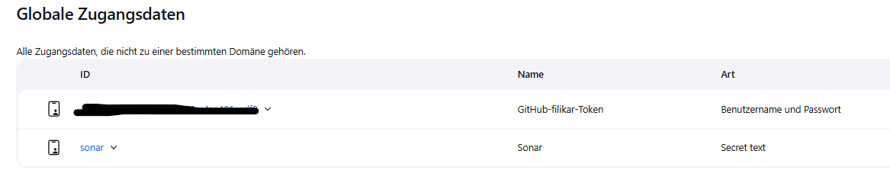

Im `Jenkinsfile` im Repository `DevOps-03-DevOpsDemo` wurden anschliessend folgende Anpassungen vorgenommen:

- Anpassung der Repository-URL auf das eigene GitHub-Repository:  
  `https://github.com/karlofilipovic01/DevOps-03-DevOpsDemo`
- Anpassung des Node.js-Namens:  
  Da Node.js in Jenkins als `22.11.0` konfiguriert ist, musste die Bezeichnung im `Jenkinsfile` entsprechend geändert werden.
- Aktualisierung der `credentialsId` für SonarQube auf `sonar`, passend zur in Jenkins hinterlegten ID des Tokens.

Diese Anpassungen wurden im entsprechenden Repository comitted.

Zur Überprüfung wurde das Skript manuell aus dem Repository kopiert, eingefügt und erfolgreich im Jenkins ausgeführt.

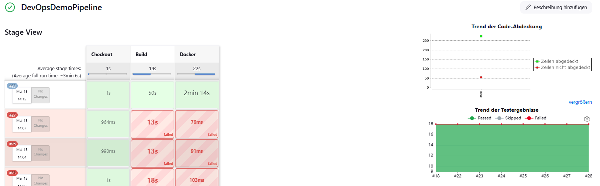

Manueller Skript:

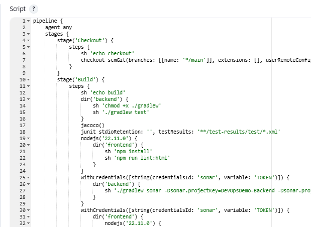

--- 

Im nächsten Schritt wird das Pipeline-Skript nicht mehr manuell in Jenkins eingegeben, sondern automatisch aus dem Versionskontrollsystem (SCM) geladen.
Dazu wird unter **Definition** die Option **Pipeline script from SCM** ausgewählt. Im Feld **Script Path** wird der Pfad zur Pipeline-Datei angegeben – typischerweise `Jenkinsfile`, welches im Root-Verzeichnis des Projekts liegt.

Diese Methode bietet den Vorteil, dass die gesamte Build-Logik versioniert und nachvollziehbar gespeichert wird – analog zur klassischen Code-Entwicklung. Änderungen an der Pipeline sind somit transparent, historisierbar und im Team kollaborativ wartbar.

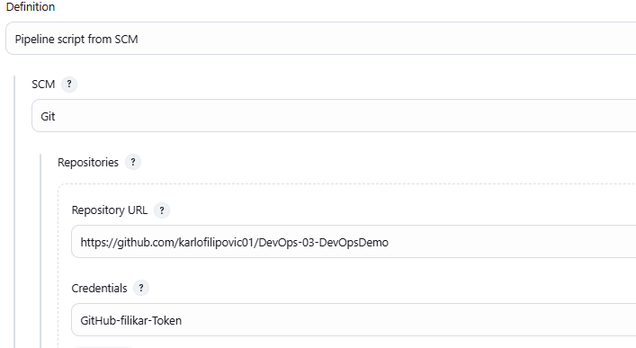

Der Build kann anschliessend erneut ausgeführt werden. Dabei wird automatisch auf das im Repository gespeicherte `Jenkinsfile` zurückgegriffen, sodass alle definierten Schritte eigenständig durch Jenkins ausgeführt werden. Dazu gehören unter anderem das Frontend- und Backend-Building, die Testabdeckung mit JaCoCo, die Testergebnisse über JUnit, die statische Codeanalyse mit SonarQube sowie der Docker-Build. 

Im folgenden Screenshot ist der erfolgreiche Build-Vorgang zu sehen, ebenso wie der Commit, der die Anpassung des `Jenkinsfile` dokumentiert.

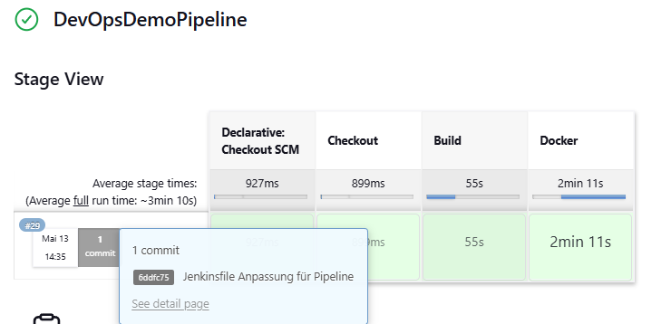

