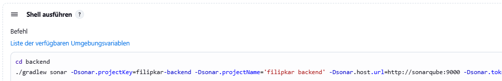

# DevOps 08 CI2

## Lernjournal

### Jenkins und SonarQube: Warum gleiches Docker-Netzwerk?

Da sowohl Jenkins als auch SonarQube in separaten Docker-Containern laufen, befinden sie sich standardmässig in voneinander isolierten Netzwerken. Das bedeutet, dass ein Container (z. B. Jenkins) einen anderen (z. B. SonarQube) nicht direkt über `localhost` erreichen kann, weil sich `localhost` jeweils nur auf den eigenen Container bezieht.

Um eine direkte Kommunikation zu ermöglichen, müssen beide Container im **gleichen benutzerdefinierten Docker-Netzwerk** verbunden sein. Dadurch können sie sich gegenseitig über ihre Container-Namen (z. B. `sonarqube`) ansprechen. In den Sonar-Analyse-Befehlen muss deshalb `localhost` durch den tatsächlichen Container-Namen ersetzt werden.

### Netzwerk Erstellung 

In `cmd` ein eigenes Netzwerk mit dem Befehl `docker network create jenkins-network` erstellen.

Anschliessend kann jeweils SonarQube und Jenkins mit den zwei Befehlen zum Netzwerk hinzugefügt werden:

- docker network connect jenkins-network sonarqube
- docker network connect jenkins-network jenkins

### Shell-Befehl in Jenkins als Post-Build-Aktion einfügen

In Jenkins wird unter **Konfiguration** der Bereich **Post-Build-Aktionen** geöffnet. Dort wird die Option **Build-Schritt hinzufügen** ausgewählt und anschliessend **Shell ausführen“** als Schritt gewählt. In das erscheinende Eingabefeld wird der benötigte Shell-Befehl eingegeben. Nach dem Eintragen wird die Konfiguration gespeichert, sodass der Befehl automatisch nach dem Build-Prozess ausgeführt wird. Befehl: 

`cd backend ./gradlew sonar -Dsonar.projectKey=filipkar-backend -Dsonar.projectName='filipkar backend' -Dsonar.host.url=http://sonarqube:9000 -Dsonar.token=sqa_70eb3402faeb58043659a31d8f016ec1b43bc98f`

Der gleiche Prozess wird auch für das Frontend gemacht. Ein neuer Build-Schritt wird hinzugefügt. Nach dem Eintragen wird die Konfiguration gespeichert, sodass der Befehl automatisch nach dem Build-Prozess ausgeführt wird.

Nachdem beide Shell-Befehle für die SonarQube-Analyse erfolgreich in die Jenkins-Konfiguration integriert wurden, wird der Build gestartet. In der Build-Übersicht ist deutlich ersichtlich, dass der Build erfolgreich durchgelaufen ist und die Anbindung an SonarQube korrekt funktioniert hat.

Zur Kontrolle kann auch im SonarQube nachgeschaut werden, ob die Analyse erfolgreich war.

### Jenkins und Docker-Integration

Für die Docker-basierte Build-Ausführung wird in Jenkins ein neues Projekt mit dem Namen `DevOpsDemoDockerBuild` angelegt. Dabei handelt es sich um ein Freestyle-Projekt mit minimaler Grundkonfiguration. Zunächst wird das entsprechende GitHub-Repository angegeben, aus dem der Code bezogen werden soll. Da in einem früheren Schritt bereits ein gültiger Zugangstoken als Credential hinterlegt wurde, kann dieser nun direkt ausgewählt werden.

Im nächsten Schritt wird ein **Build-Schritt** hinzugefügt, der einen Docker-Befehl ausführt – beispielsweise um ein Image zu bauen. Wichtig ist hierbei, dass Docker aus Jenkins heraus angesprochen werden kann. Standardmässig ist das nicht möglich, wenn der Docker-Daemon nicht korrekt erreichbar ist.

Damit Jenkins per TCP auf den Docker-Daemon zugreifen kann, muss in **Docker Desktop** unter den Einstellungen die Option  
**Expose daemon on tcp://localhost:2375 without TLS** aktiviert werden.

Erst nach dieser Konfiguration ist ein Zugriff über die Umgebungsvariable `DOCKER_HOST=tcp://host.docker.internal:2375` möglich. Anschliessend kann der Build über den Button **Jetzt bauen** gestartet werden. Im folgenden Schritt sollte der Build erfolgreich durchlaufen und die Docker-Aktion abgeschlossen werden.

### Jenkins-Pipeline

Für den Jenkins-Pipeline-Build wird in Jenkins ein neues Projekt mit dem Namen `DevOpsDemoDockerBuild` angelegt. Dabei handelt es sich um ein **Pipeline**-Projekt mit  Grundkonfigurationen.

Unter dem Reiter **Pipeline** wird das gewünschte Skript in das Feld **Script** eingefügt.

Anschliessend kann der Build-Vorgang über den Button **Ausführen** gestartet werden.

// 32.14

